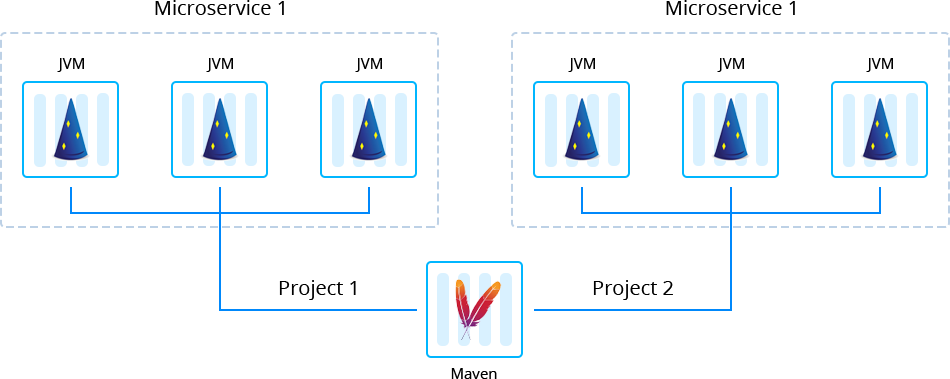

 

# Dropwizard Framework for Java Microservices

[Dropwizard’s](https://dropwizard.io/) ecosystem provides all of the required dependencies/libraries to create the light-weight and pretty fast applications in a simple way. Being bundled with all necessary Java outfit, the Dropwizard framework allows to forget about configuration issues and to concentrate on business logic creating the RESTful microservice projects.

The application can be packaged in the **Fat Jar** format automatically with the help of [Dropwizard Framework Builder Add-On](https://github.com/jelastic-jps/dropwizard/tree/master/microservice-fat-jar) prepared by Jelastic. The topology will consist of Maven build node and JVM containers for running microservices.

## Managed Hosting Business on Dropwizard Framework
To start offering this solution to your customers please follow to [Managed PaaS Hosting Business](https://jelastic.com/apaas/)
